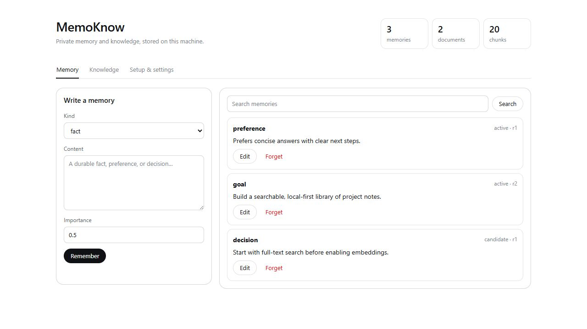
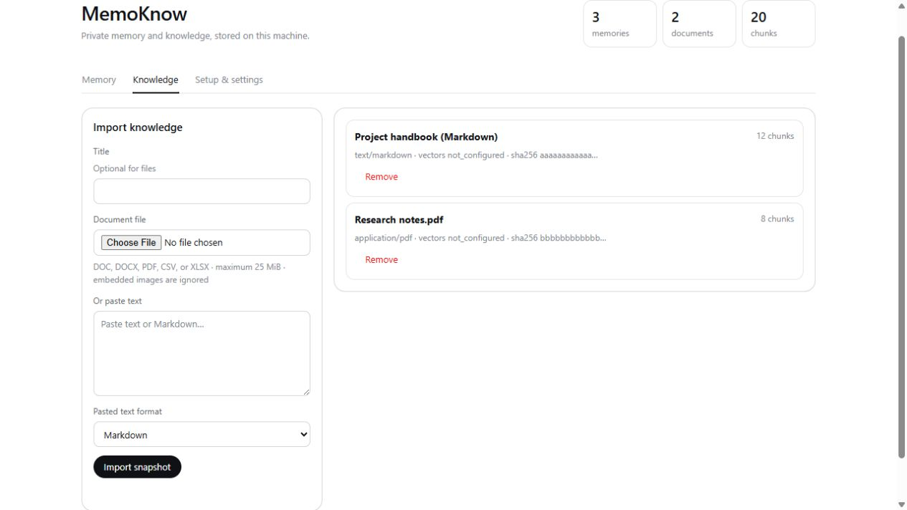
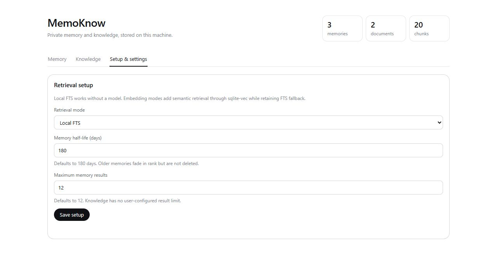

# MemoKnow for DeepSeek Harness

MemoKnow is a local-first DeepSeek Harness plugin for personal memory and
user-imported knowledge. It stores structured records in SQLite, snapshots
original documents by SHA-256, combines FTS5 with optional sqlite-vec semantic
retrieval, exposes agent tools, and provides a management screen inside DSH.

MemoKnow is an independent community plugin, not an official DeepSeek Harness
component. It is designed for one person's local DSH profile; it is not a
multi-user service or a cloud sync product.

## What it does

- Distills durable facts, preferences, and decisions from eligible completed
  chat turns; explicit “please remember” requests are processed sooner.
- Lets you inspect, edit, and permanently forget individual memories in the
  DSH **Settings → MemoKnow** section.
- Imports text/Markdown, Word, PDF, CSV, and Excel documents as immutable local
  knowledge snapshots with searchable text. Embedded images are ignored.
- Starts with Local FTS, so no embedding model or API key is needed. Optional
  CPU or OpenAI-compatible embeddings improve knowledge retrieval.

## A quick look

These captures show MemoKnow's real management page with synthetic demo
records. They contain no private chat or imported documents.

Write, search, edit, and forget individual memories:



Import a document or paste Markdown, then inspect the searchable library:



Start with Local FTS and adjust retrieval settings when needed:



For step-by-step setup, daily use, backups, and troubleshooting, read the
[user manual](docs/USER_MANUAL.md). Contributors should read
[CONTRIBUTING.md](CONTRIBUTING.md); release changes are in
[CHANGELOG.md](CHANGELOG.md).

## Quick start from a checkout

Requires Node.js `^22.19.0 || >=24.0.0`, pnpm 11.7, and a compatible DSH
installation. Run these commands from the MemoKnow checkout:

```powershell
pnpm install --frozen-lockfile
pnpm run check
dsh plugin --profile web add .
```

If your DSH installation is a source checkout and `dsh` is not on `PATH`, use
`pnpm dsh plugin --profile web add <absolute-path-to-MemoKnow>` from the DSH
repository root instead. To install a prebuilt GitHub Release tarball, use
`dsh plugin --profile web add <path-to-tarball>`. Restart the web profile after
installation. Direct `github:` installation is not supported yet: Git installs
source files, and this package does not currently build during Git install.
These commands follow DSH's [plugin packaging guide](https://github.com/deepseek-ai/deepseek-harness/blob/master/docs/user/develop/basic/publish.md)
and [CLI reference](https://github.com/deepseek-ai/deepseek-harness/blob/master/apps/cli/reference/README.md).

Restart DSH after installing, open **Settings → MemoKnow**, and select
**Setup & settings**. Local FTS is the default and needs no model. Local CPU
embedding downloads the pinned INT8 `Xenova/multilingual-e5-small` model on
first enable (about 140 MiB including tokenizer files). OpenAI-compatible mode
validates its endpoint and model before activation. FTS remains available if an
embedding provider later becomes unavailable.

If API mode is selected, put the key in the named environment variable (default
`MEMOKNOW_EMBEDDING_API_KEY`). MemoKnow stores only that variable's name, never
the secret value.

## Managed embedding policy

Products that embed MemoKnow can enforce one OpenAI-compatible embedding
provider through the standard Cordis plugin config while keeping the public
plugin source unchanged:

```yaml
- id: dsh-memoknow
  name: '@dsh-external/dsh-memoknow'
  config:
    embedding:
      source: managed-api
      baseUrl: https://managed.example/v1
      model: managed-embedding-model
      apiKeyEnv: MEMOKNOW_EMBEDDING_API_KEY
```

Managed mode projects these values into the runtime settings and disables their
controls in the management page. Settings API updates cannot override the
policy. The endpoint must use HTTPS, except for loopback development addresses.
Only the environment-variable name belongs in config; the API key value must be
provided through the process environment and is never returned by MemoKnow.

## Local data

The default data root is `$DSH_HOME/memoknow`, or `~/.dsh/memoknow` when
`DSH_HOME` is unset:

```text
memoknow.sqlite3
objects/sha256/aa/bb/<full-sha256>[.txt]
models/                         # created only after Local CPU is enabled
```

Use the plugin `dataDir` setting in the Cordis patch to choose another root.
SQLite is authoritative for metadata and lifecycle state. Original document
snapshots are immutable files. FTS and sqlite-vec indexes are derived data.

## Knowledge imports

The management page accepts pasted text/Markdown and files up to 25 MiB:

- Word `.doc` and `.docx`
- PDF with an extractable text layer
- CSV encoded as UTF-8
- Excel `.xlsx`

The exact original bytes are retained. Embedded images are not extracted,
embedded, or indexed. Scanned image-only PDFs therefore require OCR, which is
not part of this release. Legacy Excel `.xls` is not supported yet.

## Agent tools

- `memoknow_remember`
- `memoknow_search`
- `memoknow_memory_list`
- `memoknow_memory_update`
- `memoknow_memory_forget`
- `memoknow_knowledge_import`
- `memoknow_knowledge_remove`

Memory age lowers retrieval rank toward a floor but does not delete records.
Forget removes a memory row and its search-index entry without creating a
tombstone. Automatic tombstone maintenance for outdated records is a design
goal, not a feature of this version. Forgetting a derived memory does not delete
its originating DSH chat session or other backups. Knowledge removal deletes the
document/index records; a content-addressed original is deleted only after its
final reference is removed.

The default memory half-life is 180 days and automatic recall returns at most 12
memory records. Knowledge has no user-configured result cap; retrieval still uses
an internal safety ceiling to protect the agent context and SQLite process.

## Automatic memory updates

After a completed root-agent turn, MemoKnow records only new direct-user and
visible assistant text. It excludes failed turns, subagents, tool/plugin context,
reasoning blocks, trivial acknowledgements, and credential-like content. This
local capture does not call a model and advances a durable per-session checkpoint.

Eligible turns are distilled with the model already configured for that DSH
session. Ordinary updates are batched for two minutes or five eligible turns;
an explicit request such as “please remember” bypasses the delay. The model sees
only the pending delta plus a small set of lexically related memories, has no
tools, is limited to 700 output tokens and a 45-second call, and must return
validated JSON. Inferred memories enter as `candidate`; explicitly requested
memories may enter as `active`.

Capture and processing are separate transactions. A restart, timeout, model
failure, revision conflict, or token-budget refusal leaves captured turns pending
for a later retry. Successful memory changes, usage accounting, and checkpoint
advancement commit atomically. Defaults cap automatic distillation at 8,000
tokens per session and 30,000 tokens per UTC day.

## Security notes

The management API is same-origin, rejects cross-site mutations, limits JSON
bodies to 1 MiB and file requests to 26 MiB, validates file signatures, uses
parameterized SQL, sets restrictive browser headers, and never returns secret
settings. Keep the DSH web host bound to loopback unless you add an
authenticated reverse proxy.

Please report security concerns through [SECURITY.md](SECURITY.md) rather
than a public issue.

## Current limitations

- Automatic distillation uses the active DSH session model; there is not yet a
  separate model or budget control in the MemoKnow settings page.
- PDF import does not OCR scanned pages and deliberately ignores images.
- Local CPU embedding runs on CPU through Transformers.js. Initial download and
  indexing can take time on slower connections or large libraries.
- Excel `.xls`, password-protected files, macros, and embedded images are not
  imported.
- The management page uses simple prompt/confirm controls for edits and deletes.
